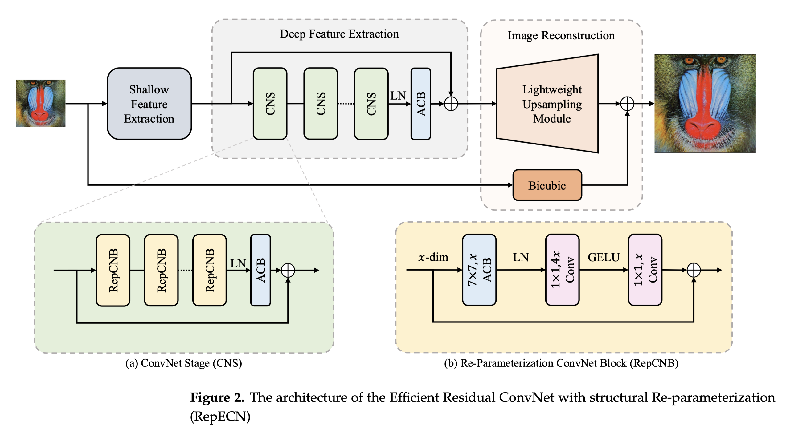

# RepECN

This repository is an official PyTorch implementation of the paper **"RepECN: Making ConvNets Better again for Efficient Image Super-Resolution"** from **Sensors** ([paper](https://www.mdpi.com/1424-8220/23/23/9575), [pretrained models](https://github.com/qpchen/RepECN/releases), [visual results](https://github.com/qpchen/RepECN/releases)).

<!-- If you find our work useful in your research or publication, please cite our work:

[1] Bee Lim, Sanghyun Son, Heewon Kim, Seungjun Nah, and Kyoung Mu Lee, **"Enhanced Deep Residual Networks for Single Image Super-Resolution,"** <i>2nd NTIRE: New Trends in Image Restoration and Enhancement workshop and challenge on image super-resolution in conjunction with **CVPR 2017**. </i> [[PDF](http://openaccess.thecvf.com/content_cvpr_2017_workshops/w12/papers/Lim_Enhanced_Deep_Residual_CVPR_2017_paper.pdf)] [[arXiv](https://arxiv.org/abs/1707.02921)] [[Slide](https://cv.snu.ac.kr/research/EDSR/Presentation_v3(release).pptx)]
```
@InProceedings{Lim_2017_CVPR_Workshops,
  author = {Lim, Bee and Son, Sanghyun and Kim, Heewon and Nah, Seungjun and Lee, Kyoung Mu},
  title = {Enhanced Deep Residual Networks for Single Image Super-Resolution},
  booktitle = {The IEEE Conference on Computer Vision and Pattern Recognition (CVPR) Workshops},
  month = {July},
  year = {2017}
}
``` -->
We provide scripts for reproducing all the results from our paper. You can train your model from scratch, or use a pre-trained model to enlarge your images.


---

> Traditional Convolutional Neural Network (ConvNet, CNN)-based image super-resolution (SR) methods have lower computation costs, making them more friendly for real-world scenarios. However, they suffer from lower performance. On the contrary, Vision Transformer (ViT)-based SR methods have achieved impressive performance recently, but these methods often suffer from high computation costs and model storage overhead, making them hard to meet the requirements in practical application scenarios. In practical scenarios, an SR model should reconstruct an image with high quality and fast inference. To handle this issue, we propose a novel CNN-based Efficient Residual ConvNet enhanced with structural Re-parameterization (RepECN) for a better trade-off between performance and efficiency. A stage-to-block hierarchical architecture design paradigm inspired by ViT is utilized to keep the state-of-the-art performance, while the efficiency is ensured by abandoning the time-consuming Multi-Head Self-Attention (MHSA) and by re-designing the block-level modules based on CNN. Specifically, RepECN consists of three structural modules: a shallow feature extraction module, a deep feature extraction, and an image reconstruction module. The deep feature extraction module comprises multiple ConvNet Stages (CNS), each containing 6 Re-Parameterization ConvNet Blocks (RepCNB), a head layer, and a residual connection. The RepCNB utilizes larger kernel convolutions rather than MHSA to enhance the capability of learning long-range dependence. In the image reconstruction module, an upsampling module consisting of nearest-neighbor interpolation and pixel attention is deployed to reduce parameters and maintain reconstruction performance, while bicubic interpolation on another branch allows the backbone network to focus on learning high-frequency information. The extensive experimental results on multiple public benchmarks show that our RepECN can achieve 2.5$\sim$5$\times$ faster inference than the state-of-the-art ViT-based SR model with better or competitive super-resolving performance, indicating that our RepECN can reconstruct high-quality images with fast inference.



## Dependencies
* Python 3.6
* PyTorch >= 1.10.0
* numpy
* scikit-image \[instead of skimage\]
* **imageio**
* matplotlib
* tqdm
* cv2 >= 3.xx (Only if you want to use video input/output) \[should `pip install opencv-python`\]
* torchinfo
* thop
* timm
* mmdet
* pytorch_wavelets


## Code
- Clone this repository into any place you want.
```bash
git clone https://github.com/qpchen/RepECN
cd RepECN
```

- Create a conda virtual environment and activate it:
``` bash
conda create -n repecn python=3.9 -y
conda activate repecn
```

- Install `CUDA>=10.2` with `cudnn>=7` following
  the [official installation instructions](https://docs.nvidia.com/cuda/cuda-installation-guide-linux/index.html)
- Install `PyTorch>=1.10.0` and `torchvision>=0.9.0` with `CUDA>=10.2` following the [official installation instructions](https://pytorch.org/get-started/previous-versions/):

For examples, to install torch==1.10.1 with CUDA==11.1:
```bash
pip install torch==1.10.1+cu111 torchvision==0.11.2+cu111 torchaudio==0.10.1 -f https://download.pytorch.org/whl/cu111/torch_stable.html
```

- Install `timm==0.6.11` and `mmcv-full==1.5.0`:

```bash
pip install -U openmim
mim install mmcv-full==1.5.0
pip install timm==0.6.11 mmdet==2.28.1
```

- Install other requirements:

```bash
pip install opencv-python termcolor yacs pyyaml scipy scikit-image imageio matplotlib tqdm torchinfo thop pytorch_wavelets
```

<!-- - Compiling CUDA operators
```bash
cd ./src/model/ops_dcnv3
sh ./make.sh
# unit test (should see all checking is True)
python test.py
cd ../../..
```
- You can also install the operator using .whl files
[DCNv3-1.0-whl](https://github.com/OpenGVLab/InternImage/releases/tag/whl_files) -->

### Data Preparation

## Quickstart (Demo)
You can test our super-resolution algorithm with your images. Place your images in ``test`` folder. (like ``test/<your_image>``) We support **png** and **jpeg** files.

Run the script in ``src`` folder. Before you run the demo, please uncomment the appropriate line in ```demo.sh``` that you want to execute.
```bash
cd src       # You are now in */RepECN/src
sh demo.sh
```

You can find the result images from ```experiment/test/results``` folder.

You can evaluate your models with widely-used benchmark datasets:

[Set5 - Bevilacqua et al. BMVC 2012](http://people.rennes.inria.fr/Aline.Roumy/results/SR_BMVC12.html),

[Set14 - Zeyde et al. LNCS 2010](https://sites.google.com/site/romanzeyde/research-interests),

[B100 - Martin et al. ICCV 2001](https://www2.eecs.berkeley.edu/Research/Projects/CS/vision/bsds/),

[Urban100 - Huang et al. CVPR 2015](https://sites.google.com/site/jbhuang0604/publications/struct_sr).

For these datasets, we first convert the result images to YCbCr color space and evaluate PSNR on the Y channel only. You can download [benchmark datasets](https://cv.snu.ac.kr/research/EDSR/benchmark.tar) (250MB). Set ``--dir_data <where_benchmark_folder_located>`` to evaluate the RepECN with the benchmarks.

## How to train RepECN
We used [DIV2K](http://www.vision.ee.ethz.ch/%7Etimofter/publications/Agustsson-CVPRW-2017.pdf) dataset to train our model. Please download it from [here](https://cv.snu.ac.kr/research/EDSR/DIV2K.tar) (7.1GB).

Unpack the tar file to any place you want. Then, change the ```dir_data``` argument in ```src/option.py``` to the place where DIV2K images are located.

We recommend you to pre-process the images before training. This step will decode all **png** files and save them as binaries. Use ``--ext sep_reset`` argument on your first run. You can skip the decoding part and use saved binaries with ``--ext sep`` argument.

If you have enough RAM (>= 32GB), you can use ``--ext bin`` argument to pack all DIV2K images in one binary file.

You can train RepECN by yourself. All scripts are provided in the ``src/scripts/train_repecn.sh``. 

```bash
cd src       # You are now in */RepECN/src
# train RepECN (x2) model
./scripts/train_repecn.sh train 0 1 b b 2 48 ms 1acb3 1acb3 batch befln nolr 2e-4 bicubic 0 0
# train RepECN (x3) model
./scripts/train_repecn.sh train 0 1 b b 3 48 ms 1acb3 1acb3 batch befln nolr 2e-4 bicubic 0 0
# train RepECN (x4) model
./scripts/train_repecn.sh train 0 1 b b 4 48 ms 1acb3 1acb3 batch befln nolr 2e-4 bicubic 0 0
```

Then, you can evaluate the trained model by first switch the ACB block to the conventional convolutional block.

```bash
# switch ACB to CNN for trained RepECN (x4) model
./scripts/train_repecn.sh switch 0 1 b b 4 48 ms 1acb3 1acb3 batch befln nolr 2e-4 bicubic 0 0
# test the trained RepECN (x4) model
./scripts/train_repecn.sh eval 0 1 b b 4 48 ms 1acb3 1acb3 batch befln nolr 2e-4 bicubic 0 0
```

You can also do lam analysis for the scale 4 models.

```bash
# do LAM analysis on RepECN (x4) model
./scripts/train_repecn.sh lam 0 1 b b 4 48 ms 1acb3 1acb3 batch befln nolr 2e-4 bicubic 0 0
```

## Citation
    @article{chen2023repecn,
      title={RepECN: Making ConvNets Better again for Efficient Image Super-Resolution},
      author={Chen, Qiangpu and Qin, Jinghui and Wen, Wushao},
      journal={Sensors},
      year={2023}
    }


## License and Acknowledgement
This project is released under the MIT license. The basic framework codes are based on [EDSR](https://github.com/sanghyun-son/EDSR-PyTorch). The LAM analysis, ACB, and DBB codes are based on [FriedRiceLab](https://github.com/Fried-Rice-Lab/FriedRiceLab), [ACNet](https://github.com/DingXiaoH/ACNet), and [DiverseBranchBlock](https://github.com/DingXiaoH/DiverseBranchBlock), respectively. Please also follow their licenses. Thanks for their awesome works.
